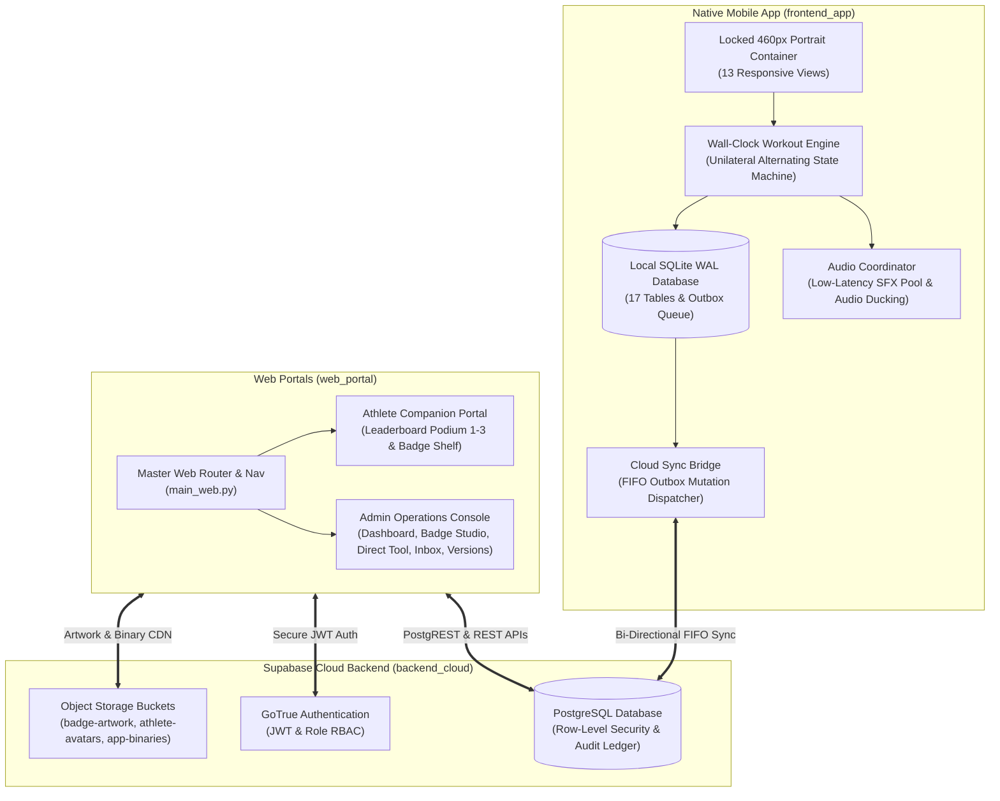

# Aesthetic Physique Builder — Multi-Platform Ecosystem

> **High-Performance Fitness Engineering & Gamified Athletic Development**  
> *A unified ecosystem comprising a Native Mobile Application, Web Companion Portal, Administrative Operations Console, and Supabase Cloud Sync Engine.*

---

## 🏛️ System Architecture



---

## 📂 Complete Project Inventory (41 Files)

```
Aesthetic Physique Builder/
├── frontend_app/                             # Phase 1: Native Mobile Client (460px Portrait)
│   ├── assets/
│   │   ├── audio/sfx/ (tick.mp3, bell.mp3, whistle.mp3)
│   │   └── images/workouts/ (All 52 exercise demonstration GIFs)
│   ├── config/
│   │   ├── default_config.py                 # Layout constraints, tier colors, timers, personas
│   │   └── exercise_catalog.py               # Complete 52 exercises & DAY-A..G dual-split routines
│   ├── database/
│   │   ├── local_schema.sql                  # 17 SQLite tables in WAL mode with foreign keys
│   │   └── db_manager.py                     # Thread-safe SQLite CRUD manager & session cache
│   ├── engine/
│   │   ├── audio_coordinator.py              # Sound pool, background ducking, and TTS fallback
│   │   ├── workout_engine.py                 # Non-drift wall-clock timer & unilateral state machine
│   │   ├── sync_worker.py                    # Network reachability detector
│   │   └── cloud_sync_bridge.py              # Offline-first SQLite <-> Supabase sync bridge
│   ├── views/
│   │   ├── components/
│   │   │   ├── requirements_shelf.py         # Dynamic equipment prerequisite badges
│   │   │   └── numeric_keypad_modal.py       # Tactile number pad for logging failure reps
│   │   ├── onboarding/
│   │   │   ├── disclaimer_view.py            # Legal liability disclaimer gate
│   │   │   ├── warning_view.py               # Physical injury risk warning gate
│   │   │   └── plan_alignment_view.py        # 7-Day calendar day-to-split alignment wizard
│   │   ├── workout/
│   │   │   ├── pre_workout_view.py           # Routine preview, gear checklist, continue/restart
│   │   │   ├── workout_player_view.py        # 16:9 looping GIF, touch-lock, reps counter
│   │   │   └── rest_panel_view.py            # Rest countdown, upcoming GIF preview, +20s/SKIP
│   │   ├── activity/
│   │   │   └── activity_ledger_view.py       # Water (ml), Sleep (hrs), and Protein (g) loggers
│   │   ├── profile/
│   │   │   ├── profile_view.py               # Vanity title, biometrics form, account teardown
│   │   │   ├── badge_showcase_view.py        # Full metallic vs grayscale locked badge grid
│   │   │   └── badge_detail_modal.py         # Accolade inspection dialog & title equip hook
│   │   ├── settings/
│   │   │   └── settings_view.py              # Coach voice tests, sound toggles, dynamic URLs
│   │   ├── support/
│   │   │   └── support_desk_view.py          # Athlete ticket creator and reply feed
│   │   ├── responsive_wrapper.py             # Locked 460px mobile letterbox frame (#0D1117)
│   │   └── splash_view.py                    # 2.0s branded splash with cross-fade dissolve
│   ├── requirements.txt                      # Runtime dependencies (flet, httpx, pyttsx3)
│   └── main.py                               # Master mobile router across 13 routes
│
├── web_portal/                               # Phase 2: Web Portals & Operations Console
│   ├── portal_admin/
│   │   ├── admin_config.py                   # Role RBAC, tier styling, metrics schemas, tabs
│   │   ├── services/
│   │   │   └── admin_supabase_service.py     # Elevated administrative cloud service & audit trail
│   │   └── views/
│   │       ├── admin_dashboard_view.py       # Operations telemetry, 7-day volume graph, fleet roster
│   │       ├── edit_user_modal.py            # Athlete biometrics editor with mandatory audit logging
│   │       ├── badge_studio_view.py          # Vector badge creator & programmatic constraint engine
│   │       ├── direct_badge_manager.py       # Direct assignment/revocation tool & immutable ledger
│   │       ├── admin_inbox_view.py           # Two-way support inbox with dynamic ✉️ -> 📩 indicator
│   │       └── version_manager_view.py       # Version gating, force-update kill switch & APK CDN
│   ├── portal_user/
│   │   └── views/
│   │       ├── user_portal_view.py           # Web companion portal with "Set Display" title modal
│   │       └── weekly_leaderboard_widget.py  # Weekly Arena Leaderboard with Podium Ranks 1-3 & XP
│   └── main_web.py                           # Master web entry point & topbar navigation
│
├── backend_cloud/                            # Phase 3: Cloud & Database Sync
│   ├── database/
│   │   ├── supabase_schema.sql               # PostgreSQL schema (10 tables, RLS security policies)
│   │   └── supabase_storage_policies.sql     # Storage buckets (badge-artwork, athlete-avatars, app-binaries)
│   └── client/
│       └── supabase_client.py                # Cross-platform Supabase GoTrue & PostgREST wrapper
│
├── run_ecosystem.py                          # Phase 4: Master CLI launcher & 10-point test runner
└── README.md                                 # Ecosystem documentation & deployment handbook
```

---

## ⚡ Quickstart Guide

### 1. Prerequisites
- **Python**: 3.11 or 3.12 LTS
- **OS**: Windows, macOS, or Linux

### 2. Environment Setup
```powershell
# Navigate to the project directory
cd "Aesthetic Physique Builder"

# Install all runtime dependencies
pip install -r frontend_app/requirements.txt
```

### 3. Running the Ecosystem

#### Option A: Run the Master Automated Test Suite
```powershell
python run_ecosystem.py --test
```
*Executes all 10 automated checkpoints verifying the 52 exercises, SQLite WAL database, audio coordinator, workout engine, web portals, Supabase client, and cloud sync bridge.*

#### Option B: Launch the Native Mobile App
```powershell
python run_ecosystem.py --mobile
# Or directly:
python frontend_app/main.py
```
*Opens the mobile application in a strict 460px mobile letterbox frame centered on a dark `#0D1117` canvas.*

#### Option C: Launch the Web Portals (Browser Mode)
```powershell
python run_ecosystem.py --web
# Or directly:
python web_portal/main_web.py
```
*Opens the web application in your default browser at `http://localhost:8550`, allowing seamless toggling between the **Athlete Companion Portal** and the **Admin Operations Console**.*

---

## ☁️ Supabase Cloud Setup

1. **Create a Supabase Project**: Sign in to [Supabase](https://supabase.com) and create a new project.
2. **Execute Database DDL**:
   - Open the **SQL Editor** in the Supabase Dashboard.
   - Copy and paste the contents of [`backend_cloud/database/supabase_schema.sql`](file:///backend_cloud/database/supabase_schema.sql).
   - Click **Run** to provision all 10 relational tables, RLS security policies, and seed data.
3. **Configure Storage Buckets & Policies**:
   - In the **SQL Editor**, copy and paste [`backend_cloud/database/supabase_storage_policies.sql`](file:///backend_cloud/database/supabase_storage_policies.sql).
   - Click **Run** to provision `badge-artwork`, `athlete-avatars`, and `app-binaries` with public read access and role-restricted upload policies.
4. **Set Environment Variables**:
   ```powershell
   $env:SUPABASE_URL = "https://your-project.supabase.co"
   $env:SUPABASE_ANON_KEY = "your-anon-public-key"
   $env:SUPABASE_SERVICE_ROLE_KEY = "your-service-role-secret-key"
   ```

---

## 🎯 Key Architectural Innovations

1. **Non-Drift Wall-Clock Rest Engine**:
   - Eliminates standard timer drift by pinning all phase countdowns to absolute system epoch timestamps (`time.time()`).
   - Implements unilateral alternating rest: **Side A $\rightarrow$ Intra-Set Rest $\rightarrow$ Side B $\rightarrow$ Inter-Set Rest**.

2. **Audio Ducking Coordinator**:
   - Ducks background music during the final 3 seconds (`3... 2... 1... Whistle!`) so cues cut through headphones cleanly.
   - Low-latency preloaded audio sound pools with seamless offline TTS fallback.

3. **Offline-First SQLite WAL Mode**:
   - Trainees can execute full workouts in basements or airplane mode with 100% offline persistence.
   - Mutations are captured in `sync_outbox` and flushed sequentially in strict FIFO order once online.

4. **Standardized Weekly XP Formula**:
   $$\text{Total XP} = (\text{Workouts} \times 100) + (\text{Failure Reps} \times 15) + (\text{Streak Days} \times 25) + (\text{Hydration Days} \times 10)$$
   Powers the **Weekly Arena Leaderboard** with animated Podium positions 1–3 and Ranks 4–10.

5. **Mandatory Administrative Audit Trail**:
   - All manual profile modifications, biometrics overrides, or badge assignments by coaches/admins strictly require an operational justification that is immutably logged to `public.admin_audit_logs`.
